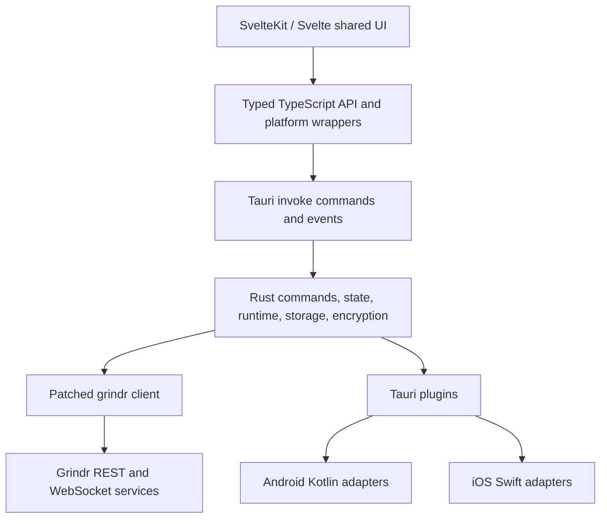

# Open Grind developer guide

Open Grind is one Tauri 2 application, not separate Android, iOS, and desktop
products. SvelteKit and Svelte implement the shared interface. Rust owns the
trusted application boundary, service transport, realtime lifecycle, protected
storage, and encrypted media. Native adapters are introduced only where an
operating-system API or distribution constraint requires them.

## Read next

- [Tauri architecture](/development/architecture) follows a request through the
  frontend, IPC, Rust runtime, transport, and storage layers.
- [Platform tracks](/development/platform-tracks) records where and why native
  paths diverge, and separates source intent from release evidence.
- [iOS development and release](/development/ios-release) separates build,
  signing, TestFlight, device acceptance, and App Store evidence.
- [Development workflow](/development/workflow) covers setup, tests, mobile
  builds, and documentation checks.
- [BUILDING.md](https://git.opengrind.org/open-grind/open-grind/src/branch/main/BUILDING.md)
  is the canonical signing and reproducibility guide.
- [CONTRIBUTING.md](https://git.opengrind.org/open-grind/open-grind/src/branch/main/CONTRIBUTING.md)
  is the canonical contribution and review contract.

The [Grindr API reference](/grindr-api/) documents the upstream protocol. Its
OpenAPI document is the source of truth; generated reference pages are derived.
