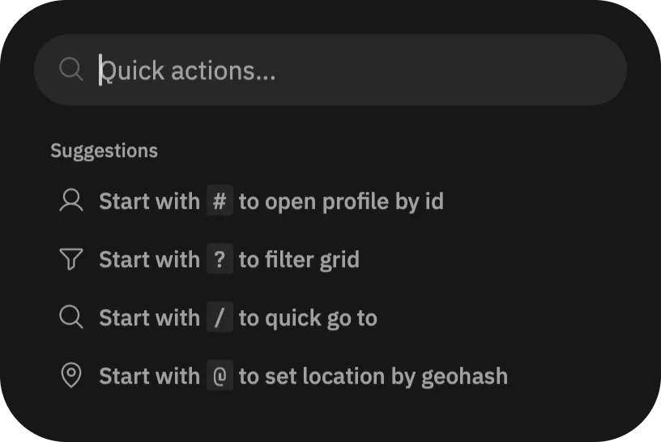

# Command Center

Command Center in Open Grind is a central place for app navigation and quick actions. To open it, locate and tap the _”"> button, at the end of filters top bar on the main "Browse" page. You can also use `⌘ + K` on macOS and `Ctrl + K` on Windows and Linux to open it.

Learn about commands:

- Start with `#` to [open profile by id](./open-profile-by-id/)
- Start with `?` to [quickly filter the grid](./quick-filters-preset/)
- Start with `/` to [quickly go to a page](./quick-go-to/)
- Start with `@` to [teleport to a location](./quick-warp/)