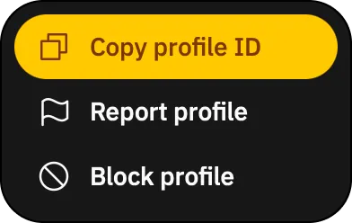
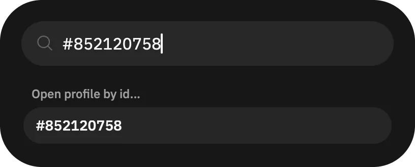

# Open Grindr profile directly by ID

To open a profile by ID in Grindr, use the [Command Center](/guides/features/command-center/).

First, copy the ID. Use the  button on the profile page. In the menu, tap "Copy profile ID" and a large number will be copied to your clipboard, like this: `852120758`.

With profile ID learned, locate the _”"> button, at the end of filters top bar on the main "Browse" page. Tap it, which opens the Command Center. You can also use `⌘ + K` on macOS and `Ctrl + K` on Windows and Linux to open it.

Finally, in the Command Center, put `#` and the profile ID after that, e.g. `#852120758`.

