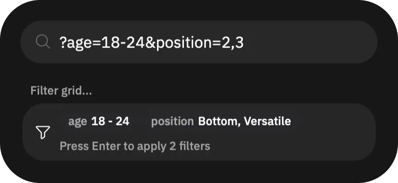

# Quickly set Grindr cascade filters

To quickly save the Browse page grid filters, use the [Command Center](/guides/features/command-center/).

First, compose the query string. The query string is mostly interoperable with [CascadeQuery], so you can learn about all keys and values there and apply them. For example, this query string will apply filters: “aged 18-24 with sexual position ID 2 or 3”:

```
?age=18-24&position=2,3
```


With this query composed, locate the _”"> button, at the end of filters top bar on the main "Browse" page. Tap it, which opens the Command Center. You can also use `⌘ + K` on macOS and `Ctrl + K` on Windows and Linux to open it.


Finally, in the Command Center, put the query, starting with `?`.

