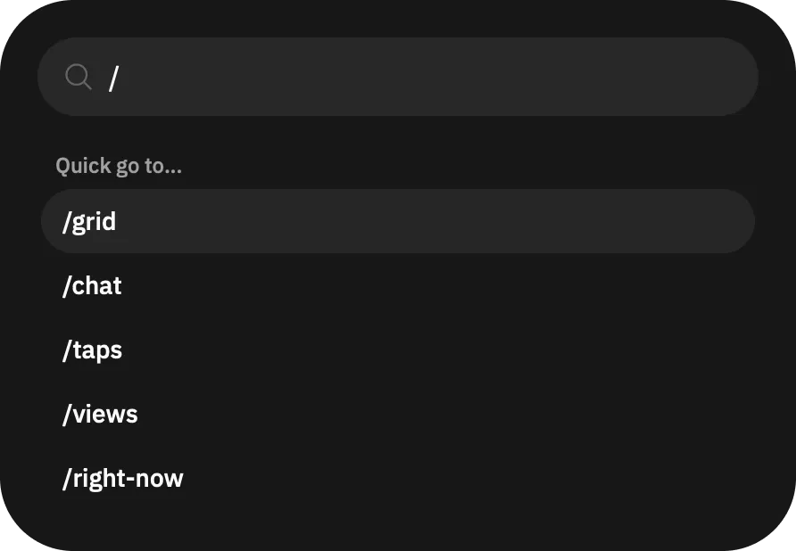

# Quickly navigate around Open Grind app

To quickly open a page in Open Grind app, use the [Command Center](/guides/features/command-center/).

Locate the _”"> button, at the end of filters top bar on the main "Browse" page. Tap it, which opens the Command Center. You can also use `⌘ + K` on macOS and `Ctrl + K` on Windows and Linux to open it.

Now in the Command Center, put `/` to see available pages, continue typing to filter results. Scroll and tap on the page to navigate. You can also move selection of the item using `↑` and `↓` keys, then navigate to the selected page using `↵` key.

