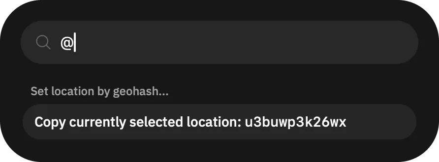
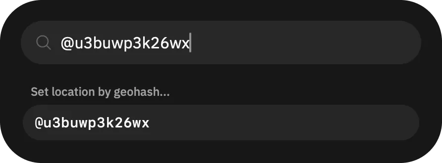

# Save & quickly warp in Grindr

To save and then quickly teleport yourself in Grindr, use the [Command Center](/guides/features/command-center/).

First, copy the geohash location. Geohash is a string of characters like `u3buwp3k26wx` that works like coordinates and encodes precise location. In this guide we'll be copying the geohash from the location you have set in the app, but you can also use [Geohash Explorer](https://geohash.softeng.co/) to encode coordinates to geohash.

Locate the _”"> button, at the end of filters top bar on the main "Browse" page. Tap it, which opens the Command Center. You can also use `⌘ + K` on macOS and `Ctrl + K` on Windows and Linux to open it.

Now in the Command Center, put `@`, which should prompt you to copy the currently selected location.

Now you have the location copied, write it down somewhere, like in a note-taking app. When you want to quickly set the location to this point, open the Command Center again, put `@` and then the geohash, e.g. `@u3buwp3k26wx`.

