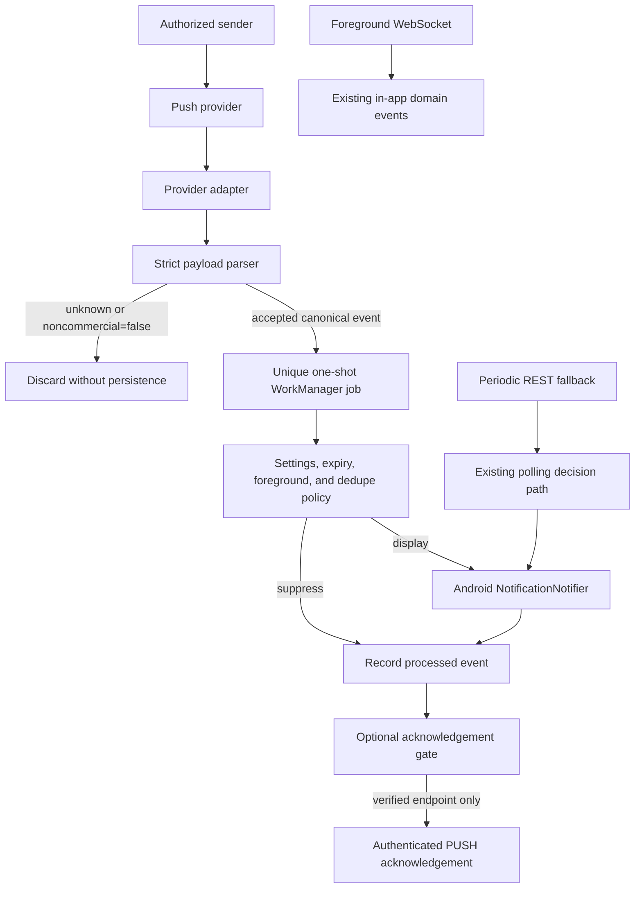
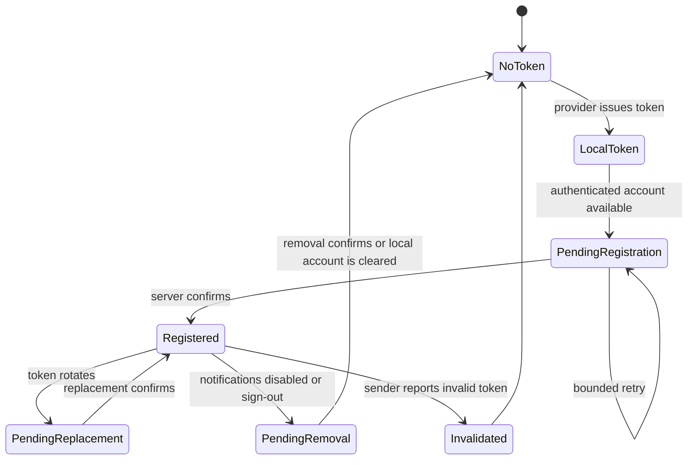
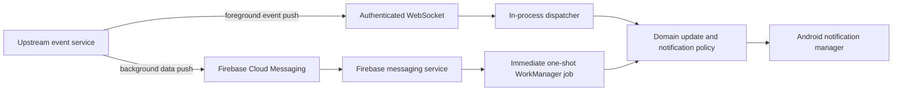

# Noncommercial notification design

**Status:** Proposed internal design; no implementation is included with this document

**Target:** Open Grind Android application

**Scope:** Messages, taps, and album activity
**Excluded:** Advertising, marketing, promotions, experiments, analytics, and generic
provider campaigns

Implementation requires a separate approval after the open decisions in section 22 are
resolved or explicitly deferred.

## 1. Executive decision

Open Grind should keep its existing periodic REST notification check as the operational
fallback and add a provider-neutral push ingress only after an authorized sender path is
available.

The target design has one canonical notification model and one presentation policy shared by
all transports:

- The foreground app receives near-real-time domain events over its existing WebSocket.
- The current Android WorkManager poll remains available in the background.
- A future push-provider adapter can deliver background events immediately, but it must pass
  them through a strict noncommercial allowlist before anything is persisted or displayed.

Push delivery is event-driven. It does not periodically check for notifications. A periodic
worker may remain as a resilience mechanism, but it is a separate transport.

An independently owned Firebase project is necessary but not sufficient for FCM. The sender
must also be authorized to send to tokens issued by that project. A token from an Open
Grind-owned Firebase project cannot simply be submitted to an unrelated sender and expected
to work. Provider ownership, token registration, and sender authorization are therefore
release blockers for live push, not Android-only setup tasks.

## 2. Evidence and clean-room boundary

This design uses behavior-level observations and the documented Open Grind API surface. It
does not copy proprietary source code, obfuscated identifiers, Firebase configuration,
credentials, project identifiers, API keys, sender identifiers, or service-account material.

Behavior relevant to the design:

- Foreground notifications arrive through a persistent WebSocket connection.
- A ten-second WebSocket ping is a connection keepalive, not a notification poll.
- Background user-content events can arrive as FCM data messages and be handed to immediate
  one-shot WorkManager work.
- Observed user-content payload categories include chat messages, taps, and album activity.
- Acknowledgements distinguish `PUSH` from `WEBSOCKET` delivery.
- Marketing delivery is a separate concern and is out of scope.

The local API reference currently describes these endpoints as work in progress:

- `POST /v3/gcm-push-tokens`
- `POST /public/v1/notifications/ack`

Static inspection of the reference APK establishes the observed request shapes: push-token
registration sends `vendorProvidedIdentifier` and `token`, while acknowledgement sends
`notificationId` and `source`. Authentication behavior, response semantics, idempotency,
removal, and account lifecycle must still be verified with a controlled account before
implementation enables either network call.

## 3. Goals

The implementation should:

1. Deliver eligible message, tap, and album notifications when the app is backgrounded or
   terminated, subject to Android platform behavior.
2. Fail closed for unknown or non-user-content payload types.
3. Avoid persisting the original provider payload.
4. Hide sender names and message text unless the user explicitly enables previews.
5. Deduplicate repeated delivery across worker retries and transport overlap.
6. Suppress Android notification banners while the app is foregrounded.
7. Route notification taps only to allowlisted in-app destinations.
8. Preserve periodic polling until push has been proven end to end.
9. Keep transport, normalization, presentation, and acknowledgement responsibilities
   separately testable.
10. Avoid logging tokens, raw payloads, message text, display names, profile identifiers, or
    authentication material.

## 4. Non-goals

This design does not include:

- advertising or sponsored-content notifications;
- lifecycle, segmentation, retention, re-engagement, or promotional campaigns;
- Braze or another marketing SDK;
- analytics events for notification receipt, display, or engagement;
- notification images, remote media downloads, or rich marketing layouts;
- a generic remote-controlled title/body/deep-link payload;
- copying or reusing another application's Firebase project;
- replacing the WebSocket protocol;
- retiring REST polling in the first release; or
- enabling an unverified push-token registration or acknowledgement endpoint.

## 5. Existing Open Grind baseline

The notification feature branch already contains reusable local infrastructure:

| Existing component | Current responsibility | Reuse decision |
| --- | --- | --- |
| `NotificationScheduler` | Schedules the 15-minute periodic REST check | Keep as fallback |
| `NotificationWorker` | Polls messages/taps and applies foreground suppression | Keep; do not turn it into a push worker |
| `NotificationBridge` | Calls authenticated Rust polling logic through JNI | Extend with separate token/ack functions only after API verification |
| `NotificationPreferences` | Stores enable/category/preview settings and watermarks | Extend with a bounded push dedupe store |
| `NotificationDecider` | Converts polling results to local notifications | Reuse presentation primitives; do not feed raw push data into it |
| `NotificationNotifier` | Creates the Android channel and safe `PendingIntent` | Reuse |
| `NotificationRoute` | Allowlists notification destinations | Reuse and extend only for a real route requirement |
| `NotificationsPlugin` | Exposes settings and Android permission commands to Tauri | Reuse |
| `MainActivity` | Consumes an allowlisted notification route | Reuse |

Push should be added beside polling, not hidden inside the polling implementation. This keeps
retry semantics, observability, and failure behavior unambiguous.

## 6. Proposed architecture



The provider adapter is deliberately thin. It supplies an envelope to the parser and owns no
presentation decisions. The parser is deliberately strict. The worker receives only a
bounded canonical event, never the provider's original map.

## 7. Canonical event contract

Proposed Kotlin model:

```kotlin
enum class PushNotificationKind {
    MESSAGE,
    TAP,
    ALBUM,
}

data class PushNotificationEvent(
    val eventId: String,
    val kind: PushNotificationKind,
    val accountBinding: String,
    val domainObjectId: String?,
    val conversationId: String?,
    val senderDisplayName: String?,
    val previewText: String?,
    val acknowledgementId: String?,
    val occurredAtMillis: Long?,
    val receivedAtMillis: Long,
    val expiresAtMillis: Long?,
)
```

Contract rules:

- `eventId` is a lowercase SHA-256 identifier used for local uniqueness. If an allowlisted
  upstream notification ID exists, hash a namespaced form of that ID. Otherwise hash a
  deterministic canonical representation of the accepted event fields.
- `accountBinding` is a non-secret stable digest of the authenticated local account identity
  captured through the native authentication boundary. The worker refuses to display an
  event if the current account binding differs.
- `domainObjectId` is an optional bounded identifier for the underlying message, tap, or album
  event. It is used only for cross-transport reconciliation and is never rendered.
- `conversationId` is optional, trimmed, and limited to 200 characters. It is never inserted
  into a route unless it matches the existing safe conversation-ID expression.
- `senderDisplayName` is optional and limited to 100 characters.
- `previewText` is optional and limited to 280 characters.
- `acknowledgementId` accepts only a conservative identifier character set and maximum
  length. It is not treated as a route or rendered as text.
- `occurredAtMillis` is an optional validated domain-event timestamp used with
  `domainObjectId` to reconcile push and polling results.
- `receivedAtMillis` records local receipt time.
- `expiresAtMillis` is derived from trustworthy provider metadata when available. Expired
  events are recorded as processed but not displayed.
- No URL, image address, HTML, arbitrary route, campaign field, analytics field, or original
  payload blob is present in the canonical event.

The serialized event should remain comfortably below WorkManager's 10 KB `Data` limit. A
hard encoded-size check should reject an event before enqueue if that invariant is violated.

## 8. Accepted payload mapping

The initial parser allowlist is exact:

| Provider `notificationType` | Required nested field | Canonical kind | Destination | User setting |
| --- | --- | --- | --- | --- |
| `chat-platform` | JSON object in `message` | `MESSAGE` or `ALBUM` based on message type | Safe conversation route, otherwise `/chat` | Messages |
| `offline-tap-sent-event-v1` | JSON object in `tap` | `TAP` | `/interest/taps` | Taps |
| `offline-tap-sent-event-v2` | JSON object in `tap` | `TAP` | `/interest/taps` | Taps |
| `fresh-albums` | Bounded JSON object in `payload` | `ALBUM` | `/chat` unless a verified conversation ID exists | Messages |

Album message-type matching should initially recognize the verified album variants only.
Album content, media references, and access tokens must not be retained in the canonical
event. Album activity uses the existing Messages setting in phase one; a separate Albums
toggle can be added later if product requirements call for it.

The parser returns rejection for:

- a missing `notificationType`;
- every value outside the exact allowlist;
- generic versioned payloads whose product purpose is ambiguous;
- malformed nested JSON;
- a provider envelope above 64 KB;
- a nested JSON field above 32 KB;
- a negative or invalid receipt time;
- explicitly deleted, retracted, or unsent chat events; and
- an encoded canonical event above the WorkManager limit.

There must be no default branch that renders a provider-supplied title, body, image, or URL.

## 9. Proposed components and functions

### 9.1 `PushNotificationEvent.kt`

Owns the canonical model and its validated serialization.

```kotlin
fun PushNotificationEvent.route(): String
fun PushNotificationEvent.toJson(): String
fun PushNotificationEvent.Companion.fromJson(value: String): PushNotificationEvent?
```

`fromJson` validates every invariant again. WorkManager input is untrusted process-boundary
data even when the application originally created it.

### 9.2 `PushNotificationPayloadParser.kt`

Owns the noncommercial allowlist and provider-to-domain normalization.

```kotlin
fun parse(envelope: PushProviderEnvelope): PushParseResult

sealed interface PushParseResult {
    data class Accepted(val event: PushNotificationEvent) : PushParseResult
    data class Rejected(val reason: RejectionReason) : PushParseResult
}
```

Rejection reasons should be low-cardinality enums safe for aggregate diagnostics, such as
`UNKNOWN_TYPE`, `MALFORMED`, `OVERSIZED`, `EXPIRED`, and `UNSUPPORTED_EVENT`. They must not
include payload text.

### 9.3 `PushNotificationIngress.kt`

Owns durable handoff and uniqueness.

```kotlin
fun enqueue(context: Context, envelope: PushProviderEnvelope): IngressResult
```

On acceptance it should enqueue `PushNotificationWorker` with:

- `OneTimeWorkRequest`, not `PeriodicWorkRequest`;
- no intentional delay;
- unique name `open-grind-push-<eventId>`;
- `ExistingWorkPolicy.KEEP`;
- the canonical serialized event as the only payload; and
- an optional short execution deadline expressed through event expiry, not an endless retry.

The function returns whether the event was accepted, rejected, or already queued. It does not
throw for ordinary malformed remote input.

### 9.4 `PushNotificationPolicy.kt`

Owns pure display decisions.

```kotlin
fun decide(
    event: PushNotificationEvent,
    settings: StoredNotificationSettings,
    appForeground: Boolean,
    alreadyProcessed: Boolean,
    nowMillis: Long,
): PushDisplayDecision
```

Possible decisions are `DISPLAY`, `SUPPRESS_DISABLED`, `SUPPRESS_CATEGORY`,
`SUPPRESS_FOREGROUND`, `SUPPRESS_DUPLICATE`, and `SUPPRESS_EXPIRED`. The worker records every
terminal accepted event as processed, including suppressed events, so later retries cannot
surface stale content.

### 9.5 `PushNotificationWorker.kt`

Owns process-safe execution:

1. Parse and revalidate the canonical event.
2. Load settings and the recent-ID store.
3. Evaluate `PushNotificationPolicy`.
4. Call the existing `NotificationNotifier` only for `DISPLAY`.
5. Record the event as processed whether display succeeds, is denied by permission, or is
   intentionally suppressed.
6. Request acknowledgement only if the endpoint contract has been verified and the durable
   event handling step has succeeded.
7. Return success for terminal policy outcomes. Retry only bounded transient failures that
   can change the result.

### 9.6 `RecentPushNotificationIds`

Extend `NotificationPreferences` with a bounded, account-aware dedupe store.

```kotlin
fun isPushProcessed(accountId: String, eventId: String): Boolean
fun markPushProcessed(accountId: String, eventId: String, processedAtMillis: Long)
fun clearPushState(accountId: String)
```

Requirements:

- Scope IDs by the authenticated account, not globally.
- Keep at most 128 recent entries per account or use an equivalent time-and-size-bounded
  representation.
- Preserve insertion order so the oldest entry is removed first.
- Remove old-account state during sign-out/account deletion.
- Do not use an unbounded `StringSet`.

### 9.7 `OpenGrindMessagingService`

This adapter is added only when the provider and sender are authorized:

```kotlin
class OpenGrindMessagingService : FirebaseMessagingService() {
    override fun onMessageReceived(message: RemoteMessage) {
        PushNotificationIngress.enqueue(
            applicationContext,
            PushProviderEnvelope.from(message),
        )
    }

    override fun onNewToken(token: String) {
        PushTokenRegistrationScheduler.replace(applicationContext, token)
    }
}
```

It should contain no event-specific notification logic and must never log the token or remote
message.

### 9.8 `PushTokenRegistrationWorker`

Owns authenticated token registration after the endpoint contract is proven.

```kotlin
fun replaceToken(token: String): RegistrationResult
fun removeToken(tokenFingerprint: String): RegistrationResult
```

The raw token must be passed directly to the authenticated native boundary, not to the
WebView. Persist it only if required for rotation/removal, using Android encrypted or
hardware-backed storage already approved for application secrets. Logs and diagnostics may
contain at most a short one-way fingerprint.

### 9.9 `NotificationAcknowledgementBridge`

Owns the optional authenticated acknowledgement call:

```kotlin
fun acknowledge(notificationId: String, source: NotificationSource): AckResult
```

For this flow, `source` is always `PUSH`. Acknowledgement is idempotent and occurs only after
the accepted event has been durably handed off or terminally processed, depending on verified
server semantics. Failure must not cause duplicate user-visible notifications. The dedupe
record is local truth; acknowledgement retry is separate work.

### 9.10 `NotificationAccountBindingBridge`

Owns the native lookup needed to keep delayed work on the correct account:

```kotlin
fun currentAccountBinding(): String?
```

The binding is derived from authenticated native state and is safe to compare and persist. It
must not expose the raw account ID or access token to provider code or logs. Ingress rejects
or defers events when no authenticated binding exists. The worker re-reads the binding before
display, token registration, and acknowledgement.

## 10. Cross-transport reconciliation and account binding

Push and REST polling can report the same domain event. WorkManager uniqueness prevents two
push workers for the same push ID, but it does not by itself prevent a later polling banner.
The implementation therefore needs a shared reconciliation layer.

For every accepted push event with a stable domain identity, store this account-scoped tuple:

```text
(accountBinding, kind, domainObjectId, occurredAtMillis)
```

The polling decision path computes the same identity for candidate messages and taps and
filters identities already recorded by push. After a successful poll advances its normal
watermarks, matching reconciliation entries may be removed. Entries are bounded by count and
age so they cannot grow indefinitely.

When a payload lacks a stable domain identity:

1. Display the accepted push according to policy.
2. Schedule a one-time reconciliation poll tagged as baseline-only.
3. The reconciliation poll advances normal watermarks without displaying candidates that
   occurred at or before the accepted push's trusted occurrence time.
4. If no trustworthy occurrence time is present, preserve the event in a short bounded
   suppression window and record the residual duplicate risk in diagnostics.

A broad time-only suppression rule must not silently hide unrelated messages. Prefer exact
domain IDs; use `(kind, conversationId, occurredAtMillis)` only as a documented fallback.

Account safety is checked twice:

- At ingress, bind the canonical event to the currently authenticated native account.
- At worker execution, compare the event binding with the current account binding.

If the account changed, the worker records `SUPPRESS_ACCOUNT_MISMATCH`, performs no display or
acknowledgement, and removes any stale registration association through the token lifecycle
path. Delayed work from one account must never render after another account signs in.

## 11. Presentation policy

Privacy defaults remain unchanged:

| Kind | Previews disabled | Previews enabled |
| --- | --- | --- |
| Message | Title `New message`; body `Open Grind` | Sender name when available; bounded message text or `Open Grind message` |
| Tap | Title `New tap`; body `Open Grind` | Title `New tap`; body `<name> tapped you` when available |
| Album | Title `New album activity`; body `Open Grind` | `<name> shared an album` when available; never show album content |

Additional rules:

- If Android notification permission is denied, processing succeeds without display.
- If application-level notifications are disabled, processing succeeds without display.
- If the relevant category is disabled, processing succeeds without display.
- If the app is foregrounded, do not post an OS notification. The WebSocket/domain event path
  remains responsible for in-app refresh.
- If the same event arrives through more than one transport, display at most once.
- Notification tap routes are generated locally. No remote route is accepted.
- Use immutable `PendingIntent` flags and the existing activity allowlist.
- Do not download remote images or media as part of notification display.

## 12. Provider and Android setup

Live FCM requires all of the following:

1. An Open Grind-controlled Firebase project.
2. An Android app registration matching the intended application ID.
3. An Open Grind-owned `google-services.json`, handled according to repository secret and
   build policies.
4. The current compatible Firebase BoM and Messaging dependency, selected against the
   repository's pinned Android Gradle Plugin and Kotlin versions.
5. Google Services Gradle plugin configuration.
6. A non-exported `FirebaseMessagingService` declaration with the FCM receive intent filter.
7. Existing `POST_NOTIFICATIONS` permission handling for Android 13 and newer.
8. A sender service authorized for the same Firebase project.
9. A verified authenticated mapping between an Open Grind session/account and the device
   token.
10. Token refresh, account switch, sign-out, uninstall expiry, invalid-token cleanup, and
    multi-device behavior.

Do not add FCM dependencies or configuration until item 8 has a real answer. Client setup
without an authorized sender adds supply-chain and configuration surface but cannot deliver a
notification.

If the upstream service only sends to its own Firebase project, the acceptable options are:

- obtain explicit authorization and a supported integration contract;
- operate an Open Grind-controlled relay that is itself lawfully able to receive upstream
  events and send through the Open Grind project; or
- retain REST polling for background delivery.

Reusing the upstream application's Firebase configuration is not an acceptable option.

## 13. Token lifecycle

The design must handle these states explicitly:



Account-switch rules:

- A token must not remain associated with the previous account after sign-out.
- Registering the same physical token to a new account must either atomically replace the old
  association or wait for confirmed removal, based on verified server behavior.
- Registration work must verify the current account immediately before sending.
- A delayed worker created under account A must not register under account B.
- Disabling notification display and unregistering push delivery should be separate settings
  if the product needs silent background refresh later. Phase one can couple them, but the
  coupling must be documented.

## 14. Acknowledgement semantics

Acknowledgements should not be enabled until these questions are answered:

- Does acknowledgement mean received by device, durably queued, displayed, or opened?
- Is the endpoint idempotent?
- What response represents an already-acknowledged notification?
- Does failure cause upstream redelivery?
- How long may acknowledgement be retried?
- Is an acknowledgement scoped to account, device, or notification only?
- Can an acknowledgement for the wrong signed-in account leak notification existence?

Provisional safe rule: record local dedupe state first, then schedule a separate bounded
acknowledgement attempt. A failed acknowledgement never clears the dedupe entry and never
causes another banner.

## 15. Failure and retry behavior

| Failure | User-visible behavior | Retry |
| --- | --- | --- |
| Unknown/marketing payload | None | No |
| Malformed/oversized payload | None | No |
| Expired event | None | No |
| Duplicate event | None | No |
| Account binding mismatch | None | No display or acknowledgement |
| Notifications disabled | None | No |
| Category disabled | None | No |
| Foreground app | In-app path only | No OS retry |
| Android permission denied | None | No display retry |
| Notification manager error | No duplicate display attempt unless the failure is proven transient | Bounded |
| Token registration network failure | Existing polling continues | Bounded backoff |
| Acknowledgement network failure | Notification remains deduplicated | Separate bounded backoff |
| Provider unavailable | Existing polling continues | Provider-controlled plus polling fallback |

WorkManager retries must have a maximum useful lifetime derived from event expiry. There is no
value in displaying a stale message notification days later.

## 16. Diagnostics and observability

Diagnostics should be locally useful and privacy-safe:

- Count accepted and rejected events by low-cardinality kind/reason.
- Record worker result, suppression reason, and coarse latency bucket.
- Record token-registration state using a short token fingerprint only.
- Record acknowledgement success/failure by status class, not response body.
- Never log raw provider maps, canonical JSON, message text, sender name, conversation ID,
  profile ID, access token, push token, notification ID, or full endpoint response.
- Debug builds may expose a local diagnostic screen with timestamps and counters, but not
  payload data.
- Release logging must be safe if copied into a bug report.

## 17. Security and privacy review

Threats and controls:

| Threat | Control |
| --- | --- |
| Remote marketing payload rendered as trusted notification | Exact type allowlist; no generic title/body path |
| Deep-link injection | Locally generated allowlisted routes only |
| WorkManager data injection/corruption | Revalidate canonical event on worker entry |
| Notification replay | Unique work name plus account-scoped bounded dedupe store |
| Cross-account notification | Bind registration, event handling, dedupe, and ack to current account |
| Push then polling duplicate | Shared domain identity reconciliation plus baseline-only refresh |
| Sensitive lock-screen disclosure | Previews disabled by default; no album media |
| Token disclosure | Native secure handling; no WebView or logging exposure |
| Oversized payload/resource exhaustion | Provider, nested JSON, canonical size, and field bounds |
| Stale event display | TTL/expiry check before presentation |
| Unauthorized project reuse | Open Grind-owned configuration and sender authorization only |
| Duplicate display after ack failure | Local dedupe committed independently of ack |

Before enabling live push, perform a focused review of Android exported components, intent
filters, token storage, JNI/native boundaries, account switching, log statements, dependency
provenance, and server authorization.

## 18. Implementation sequence

### Phase 1: Pure notification core

- Add canonical event, strict parser, pure policy, and bounded dedupe helpers.
- Add account binding and shared push/poll reconciliation identities.
- Add no provider SDK and make no new network calls.
- Reuse `NotificationNotifier`, `NotificationRoute`, settings, and foreground detection.
- Keep periodic polling unchanged.

Exit criteria: all pure unit tests pass; an independent review confirms there is no generic
marketing/advertising path and no raw-payload persistence.

### Phase 2: Dormant provider adapter

- Add the provider dependency and service only after project/sender ownership is established.
- Gate token registration and provider service enablement behind a build-time capability or
  explicit runtime readiness state.
- Do not remove polling.

Exit criteria: controlled test messages reach a debug build in foreground, background, and
terminated states without exposing content when previews are disabled.

### Phase 3: Token registration and acknowledgement

- Implement verified authenticated native calls.
- Add account-aware rotation, removal, retry, and sign-out cleanup.
- Enable acknowledgements only after semantics are proven.

Exit criteria: device and account lifecycle tests pass across token rotation, app data clear,
sign-out, account switch, reinstall, invalid token, and multi-device use.

### Phase 4: Canary and fallback evaluation

- Run push and polling concurrently with cross-transport dedupe.
- Measure delivery latency, duplicate suppression, token failures, and polling recovery.
- Keep a kill switch that disables provider registration without breaking polling.

Exit criteria: an agreed reliability window shows push is stable and privacy-safe. Any
proposal to reduce or remove polling is a separate decision.

## 19. Proposed file plan

No files in this table are implemented by this design document.

| File | Change |
| --- | --- |
| `.../notifications/PushNotificationEvent.kt` | Canonical bounded event and serialization |
| `.../notifications/PushNotificationPayloadParser.kt` | Strict user-content allowlist and normalization |
| `.../notifications/PushNotificationPolicy.kt` | Pure display/suppression decision |
| `.../notifications/PushNotificationIngress.kt` | Unique one-shot WorkManager handoff |
| `.../notifications/PushNotificationWorker.kt` | Process-safe policy and display execution |
| `.../notifications/NotificationReconciliation.kt` | Shared push/poll identity and bounded suppression state |
| `.../notifications/NotificationAccountBindingBridge.kt` | Native account-binding comparison |
| `.../notifications/PushTokenRegistrationWorker.kt` | Token lifecycle after API verification |
| `.../notifications/OpenGrindMessagingService.kt` | Thin provider adapter after sender authorization |
| `NotificationPreferences.kt` | Account-scoped bounded push dedupe state |
| `NotificationDecider.kt` | Filter candidates already reconciled from push |
| `NotificationNotifier.kt` | Reuse; only add stable per-event IDs if needed |
| `NotificationRoute.kt` | Reuse; add no remote-controlled routes |
| `AndroidManifest.xml` | Provider service declaration after provider approval |
| `app/build.gradle.kts` | Compatible provider dependency after provider approval |
| Rust notification API module | Verified token registration and acknowledgement commands |
| Notification settings UI | Explain immediate push versus periodic fallback readiness |

## 20. Test plan

### Pure JVM tests

- Each exact allowlisted type maps to the expected canonical kind.
- Missing, unknown, generic, marketing, advertisement, and promotion types are rejected.
- Malformed and oversized nested JSON is rejected.
- Album content and provider-specific fields are absent from serialized canonical events.
- Field bounds are enforced and round-trip serialization revalidates them.
- Equivalent notification IDs produce one stable event ID.
- Unsafe conversation IDs route to `/chat`.
- Preview-disabled presentation contains neither sender name nor text.
- Message, tap, and album settings suppress the expected categories.
- Foreground, duplicate, expired, and disabled states suppress display.
- The recent-ID store is account-scoped, ordered, deduplicated, and bounded.
- Push and polling representations of the same domain object reconcile to one display.
- An unrelated event in the same time window is not suppressed.
- A delayed worker created under account A is suppressed after account B signs in.

### Android integration tests

- Android 13+ permission denied, granted, and later revoked.
- App foreground, background, force-stopped/terminated, and process recreation.
- Notification tap opens only the expected route.
- Duplicate delivery and WorkManager retry show at most one banner.
- One event delivered through push and later found by polling shows at most one banner.
- Previews remain private on the lock screen with defaults.
- Token rotation, sign-out, account switch, app-data clear, reinstall, and invalid token.
- No raw payload or token appears in logcat at normal and verbose levels.

### Native/API contract tests

- Registration request schema and authenticated account binding.
- Idempotent registration of the same token.
- Atomic or ordered token replacement.
- Removal on sign-out and notification disablement.
- Acknowledgement request uses `source: PUSH` and the correct notification ID.
- Acknowledgement retry cannot redisplay an event.
- Signed-out and wrong-account calls fail without leaking notification existence.

### Manual device acceptance

1. Install a debug build on a controlled Android device.
2. Verify private defaults before granting notification permission.
3. Send controlled message, tap, and album events individually.
4. Repeat in foreground, background, and terminated states.
5. Replay each event and confirm no duplicate banner.
6. Send unknown and marketing-labelled payloads and confirm no banner or persisted payload.
7. Rotate the token and repeat delivery.
8. Sign out, switch account, and confirm the prior account receives nothing.
9. Disable push transport and confirm periodic polling still works.

## 21. Acceptance criteria

The implementation is complete only when:

- All eligible noncommercial categories work on a physical Android device.
- Unknown and explicitly non-user-content types are proven to fail closed.
- No provider payload is persisted outside bounded canonical fields.
- Preview defaults protect message text, sender names, and album content.
- Duplicate and cross-transport delivery produces at most one banner.
- Delayed work cannot display or acknowledge against a different authenticated account.
- Notification routes pass the existing allowlist.
- Foreground behavior does not create redundant OS banners.
- Token registration and acknowledgement contracts are verified, authenticated, and
  account-safe—or remain disabled with polling preserved.
- Provider project and sender authorization belong to Open Grind or are explicitly licensed.
- Logs and diagnostics contain no secrets or user-content payloads.
- Focused unit, Android integration, native contract, and physical-device tests pass.
- Periodic polling remains available behind a documented fallback/kill-switch decision.

## 22. Open decisions

These decisions block live push but not phase-one core implementation:

1. Who owns and operates the authorized sender?
2. Can the upstream token-registration endpoint send to an Open Grind-owned provider project,
   or is it tied to a provider project controlled by the upstream application?
3. What are the removal, replacement, response, and account-lifecycle contracts for the
   observed `/v3/gcm-push-tokens` registration request?
4. What does `/public/v1/notifications/ack` acknowledge operationally?
5. What TTL should apply when the provider supplies none?
6. Should disabling Background notifications unregister the token, disable local display, or
   both?
7. Should album activity remain under Messages or receive its own setting?
8. Is cross-device acknowledgement expected to clear notifications elsewhere?
9. Is an Open Grind-controlled relay acceptable operationally and legally if direct sender
   integration is unavailable?
10. What reliability window is required before polling can be reduced?

## 23. References

- [Set up an Android FCM client](https://firebase.google.com/docs/cloud-messaging/android/client)
- [Firebase API key behavior](https://firebase.google.com/docs/projects/api-keys)
- [Android notification runtime permission](https://developer.android.com/develop/ui/views/notifications/notification-permission)
- Local Open Grind API reference for `/v3/gcm-push-tokens`
- Local Open Grind API reference for `/public/v1/notifications/ack`
- Local Open Grind WebSocket notification-event reference

## Appendix A. Observed Grindr notification mechanism and setup

### A.1 Purpose, provenance, and limits

This appendix records a clean-room, behavior-level analysis of the notification mechanism in
the Grindr Android application installed on the connected test device. It exists to make the
source observations behind this design reviewable. It is not an instruction to copy Grindr
code, identifiers, branding, analytics, advertising integrations, credentials, Firebase
configuration, or proprietary project setup into Open Grind.

The inspected artifact was:

| Property | Observed value |
| --- | --- |
| Android package | `com.grindrapp.android` |
| App version | `26.12.0` |
| Version code | `169415` |
| Minimum Android SDK | 32 |
| Target Android SDK | 35 |
| Base APK SHA-256 | `c1a4684c51424389c7a7471a261cc4e4250f50225eac5b602855df58b2c17079` |
| ARM64 split SHA-256 | `4b40a5f8379898861affc4aa7e0ddd893249795bb9f0278c83eb8cd1637857b5` |
| XHDPI split SHA-256 | `5944e7302e4e9c6854cbaa7044a88f77a905dc88700a75236e325b918cf51a2a` |
| Analysis method | APK manifest/resource decoding, Java decompilation, and targeted smali corroboration |
| Dynamic delivery capture | Not performed for this appendix |

The package identity was also re-read from the connected device during the appendix evidence
pass. No notification payload, account token, FCM token, Firebase project value, API key,
sender identifier, or service-account material is reproduced here.

Evidence statements use these labels:

- **Confirmed static** means the behavior is directly represented in the decoded manifest,
  decompiled class structure, Retrofit declaration, model metadata, or corroborating smali.
- **Strong static inference** means the conclusion follows from multiple connected code paths,
  but obfuscation or incomplete decompilation prevents a literal end-to-end reconstruction.
- **Not established** means the APK alone does not prove the runtime or server-side behavior.

Several large coroutine and dispatcher methods were not reconstructed perfectly by the Java
decompiler. Claims involving those methods are limited to control flow that was readable or
corroborated in smali. No claim below should be treated as current production-server behavior
beyond version `26.12.0`.

### A.2 Direct answer: push, pull, or another mechanism?

Grindr uses two event-driven delivery paths for user-content notifications:

1. **Foreground or live-session path: WebSocket push.** The app opens an authenticated
   WebSocket to `wss://grindr.mobi/v1/ws`. The OkHttp client is configured with a 10-second
   ping interval. That ping maintains and detects the connection; it is not a ten-second
   request for notification data. Server messages are pushed over the open socket and
   dispatched inside the app. **Confirmed static.**
2. **Background or process-independent path: Firebase Cloud Messaging push.** An Android
   `FirebaseMessagingService` receives FCM data messages and transfers eligible payloads to
   immediate one-shot WorkManager work. **Confirmed static.**

No periodic worker that polls for ordinary message, tap, or album notifications was found in
the decoded artifact. A 60-minute network-constrained periodic worker was found, but it is an
inbox-advertising worker named and typed for inbox ads. It is not evidence of user-content
notification polling and is explicitly outside this design. The absence of a user-content
poller is a bounded negative result from this artifact, not proof that no server endpoint or
unrecovered code path could ever perform reconciliation. **Strong static inference.**

Accordingly, the most accurate model is:



The APK does not establish how often the upstream server checks its own databases, how it
selects devices, or which upstream component publishes to FCM. **Not established.**

### A.3 Android and provider registration

The decoded Android manifest contains the following relevant setup. **Confirmed static.**

- `android.permission.POST_NOTIFICATIONS` for Android 13 and later.
- `android.permission.WAKE_LOCK` and `android.permission.VIBRATE`.
- A non-exported Grindr Firebase messaging service registered for
  `com.google.firebase.MESSAGING_EVENT` and marked with the `remoteMessaging` foreground
  service type.
- The standard Firebase Instance ID receiver, protected by the Google C2DM send permission,
  for `com.google.android.c2dm.intent.RECEIVE`.
- WorkManager services and receivers supplied by the AndroidX library.
- A Grindr notification-handler activity for notification tap routing.
- A non-exported delete receiver used when a user dismisses certain notifications.

The manifest merge also contains the Firebase library's generic messaging service at lower
intent-filter priority. The application-specific service is the observed entry point for the
logic described below.

The APK contains Firebase, Braze, and AppsFlyer notification-adjacent components. Their mere
presence must not be interpreted as one unified notification pipeline. The application-level
FCM receiver explicitly separates them:

- AppsFlyer uninstall-tracking messages are recognized and ignored by the Grindr
  user-content worker path.
- Braze messages are recognized and delegated to the Braze handler only for a logged-in
  session.
- Other eligible FCM data messages fall through to the Grindr push worker.

Braze campaigns, AppsFlyer tracking, and all advertising or marketing setup are intentionally
not reproduced or proposed for Open Grind.

### A.4 FCM token acquisition and upstream registration

The reference app obtains two Firebase values and pairs them for registration. **Confirmed
static.**

1. `FirebaseInstallations.getId()` supplies a Firebase Installation ID.
2. `FirebaseMessaging.getToken()` supplies the current FCM registration token.
3. The pair is sent through the authenticated API layer to:

   `POST /v3/gcm-push-tokens`

4. The statically observed JSON request body has exactly these semantic fields:

   ```json
   {
     "vendorProvidedIdentifier": "<Firebase Installation ID>",
     "token": "<FCM registration token>"
   }
   ```

5. The Retrofit declaration marks the call as requiring the app's real-device-information
   request handling.

The Firebase service also implements `onNewToken`. When Firebase rotates or replaces the FCM
token, that callback launches asynchronous propagation through the app's token-handling
layer. The broader token manager can also request the current token directly. **Confirmed
static.**

The following details are not established by the APK inspection:

- whether the endpoint accepts tokens created under an independently owned Firebase project;
- which Firebase project and sender credentials the production upstream is authorized to use;
- whether a repeated request is idempotent;
- the endpoint's response semantics beyond the declared empty-success model;
- token removal or unregister endpoint behavior;
- whether sign-out removes, rebinds, or merely stops using an existing token;
- server cleanup after uninstall, provider invalidation, or prolonged inactivity; and
- multi-account and multi-device conflict rules.

These unknowns remain release blockers. The observed request schema is evidence for contract
testing; it is not evidence that Open Grind can register a token from its own Firebase project
and receive production pushes.

### A.5 Background receive and scheduling sequence

For an eligible non-Braze FCM message, the reference receiver performs this sequence.
**Confirmed static except where noted.**

1. It receives a `RemoteMessage` through `FirebaseMessagingService.onMessageReceived`.
2. It reads the FCM data map rather than relying on a provider-rendered notification payload.
3. It places the complete data map into WorkManager `Data`.
4. It builds a one-time request for the push-processing worker with an initial delay of zero
   milliseconds.
5. It enqueues unique work with `ExistingWorkPolicy.KEEP`, preventing a later work item with
   the same unique name from replacing the already-enqueued item.
6. WorkManager supplies process-independent execution subject to normal Android scheduling
   rules.

The decompiler rendered the unique-work-name expression ambiguously, apparently involving the
remote message and a `sentTime` label. Because that expression was not reliably reconstructed,
the exact deduplication key must not be copied or treated as known. **Not established.**

The worker then:

1. checks whether a user is logged in and returns success without display when signed out;
2. reads the optional outer payload version, treating version `"2"` as V2 and otherwise
   routing through the V1/default dispatcher;
3. normalizes or deserializes the selected payload path;
4. persists relevant domain content where the handler requires it;
5. applies local suppression and presentation policy;
6. optionally acknowledges V2 receipt; and
7. displays, updates, or cancels an Android notification.

The worker returns WorkManager success for handled or deliberately dropped signed-out work.
It returns failure for unsupported/failed processing and for caught exceptions. No explicit
`Result.retry()` path was observed in this push worker. Consequently, FCM redelivery,
upstream retries, or another reconciliation path may be important to delivery resilience, but
their effective runtime behavior was not measured. **Confirmed static for result selection;
runtime reliability not established.**

### A.6 Foreground WebSocket sequence

The foreground connection path is distinct from FCM. **Confirmed static.**

- The configured endpoint is `wss://grindr.mobi/v1/ws`.
- The connection carries the existing authenticated session credential.
- OkHttp sends WebSocket ping frames every 10 seconds.
- An incoming text frame is parsed as JSON.
- A frame with type `ws.connection.established` moves the local connection state to connected.
- Other frames are deserialized as server-notification objects and dispatched to registered
  in-process receivers.
- If a server notification contains a notification ID, the app invokes the acknowledgement
  path with source `WEBSOCKET`.
- Normal close, invalid-session close codes, HTTP 401 failure, and unknown failures are
  classified into connection-state reasons.

The ten-second ping interval says nothing about notification-generation frequency. A ping is
a transport health check; user events arrive whenever the server writes them to the socket.

The WebSocket client logs received JSON when its verbose logger is active. That is an observed
privacy risk in the reference behavior, not a pattern to reproduce. Open Grind's design
continues to prohibit logging raw frames or normalized user content.

### A.7 Payload families and dispatch

#### A.7.1 Outer version selection

The background worker reads a string-valued `version` field. Value `"2"` selects the V2
payload path. Missing, `"1"`, and other non-V2 values flow through the V1/default dispatcher.
**Confirmed static.** Open Grind should be stricter and reject unsupported explicit versions
rather than treating arbitrary versions as V1.

#### A.7.2 V1/default user-content families

The readable V1 dispatcher contains the following relevant families. **Confirmed static for
the keys and handler routing; nested business behavior is partly a strong static inference.**

| Outer type | Relevant outer data | Observed handling | Open Grind decision |
| --- | --- | --- | --- |
| `chat-platform` | `message`; optional `senderDisplayName`, `senderProfileImageMediaHash`, and `senderExpiringAlbumDuration` | Deserialize the nested message, process/store it, then evaluate a chat notification | Support only after mapping to a bounded canonical message event |
| `offline-tap-sent-event-v1` | `tap` | Deserialize and store a received tap, then evaluate a tap notification | Support as a canonical tap event |
| `offline-tap-sent-event-v2` | `tap` | Routes to the same received-tap handling family | Support as a canonical tap event |
| `fresh-albums` | `payload` and `notificationId` | Deserialize album-activity metadata, attach the notification ID, map to the generic display model | Support only album-activity metadata, never album media or access credentials |
| `PUSH_EVENT` | `pushEvent` | Dispatches a mixed collection of session, trial, subscription, and other events | Reject wholesale unless an independently reviewed noncommercial subtype is explicitly allowlisted |

The `message`, `tap`, and album `payload` values are strings containing nested JSON rather
than already-expanded WorkManager objects. The chat handler stores/processes the message
before notification composition. Tap handling similarly passes through the taps repository.
Album activity uses a dedicated channel and deep-link family in the reference app.

The reference app's internal album model has a branded/internal name. Open Grind must not use
that name as a domain concept. Its canonical event remains `album_activity`, with only the
minimum metadata needed to inform the user and route into an authenticated album screen.

The readable `PUSH_EVENT` cases include commercial product-session completion and trial
reminder behavior. Because the type is heterogeneous, an outer-type allowlist alone would be
unsafe. Open Grind should fail closed before persistence or display.

#### A.7.3 V2 payload shape

The V2 data-map model exposes these fields. **Confirmed static.** Required/optional status
below reflects the decompiled model's nullability and constructor shape, not a proven server
schema guarantee.

| Field | Observed role |
| --- | --- |
| `version` | Payload protocol version |
| `notificationId` | Upstream notification identity and acknowledgement key |
| `senderId` | Optional sending-profile identity |
| `title` / `titleArgs` / `translateTitle` | Literal or locally translated notification title |
| `body` / `bodyArgs` / `translateBody` | Literal or locally translated notification body |
| `action` | App deep link or control action |
| `imageUrl` | Optional image reference |
| `channel` | Requested Android notification channel |
| `timestamp` | Event time used for presentation |
| `quickReply` | Whether the mapped notification may expose a reply action |

The mapper does not accept an arbitrary Android channel or arbitrary action. It checks the
channel against an internal channel set and requires a Grindr-scheme deep link before building
display data. The resulting presentation model contains a stable string ID, integer
notification ID, sender ID, title/text objects, optional image, timestamp, channel, category,
lights, icon, alert/auto-cancel settings, priority, visibility, extras, deep link, optional
group, and optional quick-reply description. **Confirmed static.**

Observed V2 control-action families include:

- a conversation action containing a conversation ID;
- a clear action containing one or more sender/profile IDs;
- an unsend action containing a notification ID; and
- commercial boost actions, which are outside Open Grind's scope.

For a clear action, the worker reads active Android notifications, compares their bounded
`sender_id` extra, and cancels matches. For an unsend action, it locates the active Android
notification by derived integer ID and cancels it. A normal V2 event is mapped and shown.
**Confirmed static.**

Open Grind must not accept the reference V2 model as a generic server-controlled
title/body/image/deep-link interface. The safe adaptation remains the canonical allowlist in
this design: validate an exact domain type, discard unsupported fields, derive local text and
routes, and never download a remote notification image.

### A.8 Receipt acknowledgement

The reference app declares:

`POST /public/v1/notifications/ack`

with an observed JSON body:

```json
{
  "notificationId": "<upstream notification ID>",
  "source": "PUSH"
}
```

The only two source values found in the relevant call path are `PUSH` and `WEBSOCKET`.
Targeted smali inspection corroborates their boolean-to-string selection. **Confirmed static.**

The timing differs by transport:

- The V2 FCM worker calls the acknowledgement use case with `source: PUSH` immediately after
  mapping the V2 payload and before clear, unsend, or normal-display processing.
- The WebSocket dispatcher calls the same use case with `source: WEBSOCKET` when the parsed
  server notification has a notification ID.
- No corresponding acknowledgement call was found in the inspected V1 chat, tap, or album
  handlers. This is a bounded negative result, not proof that a separate unrecovered path
  cannot acknowledge them.

The APK does not establish whether acknowledgement means provider receipt, app receipt,
durable queueing, domain persistence, display, or user opening. It also does not establish
retry policy, idempotency, response semantics, cross-device effects, or whether an
acknowledgement is account-scoped. **Not established.**

Because the V2 push acknowledgement occurs before display/control-action completion, Open
Grind must not assume that this endpoint confirms successful user-visible delivery. The safe
design remains: make local durable deduplication independent of acknowledgement, and keep the
network call disabled until its semantics and account binding are verified.

### A.9 Notification channels and Android presentation

The reference app creates Android notification channels through a central channel manager.
The relevant user-content channel IDs observed in version `26.12.0` are:

- `id_grindr_notifications_channel_individual_v2` for individual chats;
- `id_grindr_notifications_channel_tap_v2` for taps;
- `id_grindr_notifications_channel_fresh_albums` for album activity; and
- `id_grindr_notifications_channel_seasonal_individual` as an optional replacement chat
  channel with a remotely selected seasonal sound.

These are evidence identifiers only and are not proposed Open Grind identifiers.

The default channel base class creates channels at Android importance 4, enables lights and
vibration, and applies an app resource sound with notification audio usage unless a subtype
overrides those properties. The seasonal chat channel is deleted and recreated when its sound
changes, with a preference recording whether it is active. Legacy channel IDs are deleted
during channel-manager initialization. **Confirmed static.**

Relevant presentation behavior includes:

- message and tap notifications use Android's message category;
- chat and tap builders can use the sender/profile image as a large icon when available;
- notifications use app-controlled content intents and an internal handler activity;
- notifications are auto-cancelled when opened;
- chat and tap notifications use lights and are generally allowed to alert more than once;
- conversation notifications are grouped and keyed from conversation identity;
- V2 supports an optional Android quick-reply action;
- dismissal can invoke a non-exported delete receiver; and
- V2 clear/unsend control payloads can cancel already-active notifications.

The final notification manager checks `POST_NOTIFICATIONS` before display. V2 display also
suppresses presentation during configured snooze and quiet-hour periods. Suppression for
permission, snooze, or quiet hours is treated as handled rather than as work requiring retry.
**Confirmed static.**

Chat-specific foreground suppression is more granular than a simple background flag:

- when in-app chat notifications are disabled, a foreground chat event is ignored;
- the app suppresses redundant banners while the chat tab is active;
- it suppresses a banner for the currently open conversation; and
- selected video-call terminal events are suppressed rather than notified.

The inspected path also rejects a chat notification when the current user is the sender.
Album-type messages update an internal album-notification counter before later policy checks.
**Confirmed static for the readable control flow.**

Open Grind should reuse the behavioral principles—stable local channels, permission checks,
foreground suppression, local route derivation, deduplication, and cancellation—without
copying Grindr channel names, branding, sounds, icons, remote image behavior, or analytics.

### A.10 Logging, diagnostics, and privacy observations

The reference code contains both redaction and unsafe verbose logging patterns:

- the FCM service can log the complete incoming data map;
- the token callback can log the complete FCM token;
- the worker can log its complete WorkManager input map;
- the V2 handler can log the mapped payload, whose string representation includes user-facing
  fields;
- the WebSocket listener can log complete received JSON; and
- one chat diagnostic helper replaces the nested message body with a redaction marker before
  producing a diagnostic map.

These facts do not demonstrate which logger is active in production builds. They do
demonstrate that copying the reference logging structure would create avoidable privacy risk.
**Confirmed static; production activation not established.**

Open Grind must therefore:

- never log raw FCM data, WebSocket frames, tokens, message bodies, titles, display names,
  image URLs, profile IDs, conversation IDs, or upstream notification IDs;
- emit only coarse event type, bounded local outcome, worker result, and redacted status
  class;
- persist only the canonical allowlisted event fields required for deduplication and display;
- fingerprint tokens only when operational correlation is necessary; and
- ensure diagnostic exports apply the same restrictions as normal logging.

### A.11 Marketing and advertising separation

The reference APK contains marketing, subscription, boost, trial, promotion, analytics, and
advertising notification paths. They are not necessary to implement message, tap, or album
notifications. Specifically:

- Braze pushes are routed away from the Grindr user-content worker;
- AppsFlyer uninstall-tracking messages are recognized separately;
- `PUSH_EVENT` includes commercial subtypes;
- the V2 channel allowlist contains commercial channels in addition to user-content channels;
- commercial workers can construct local reminders; and
- the only identified 60-minute periodic inbox worker is for advertising content.

Open Grind must not approximate “non-marketing” as “anything that is not Braze.” Its parser
must positively accept only exact message, tap, and album-activity contracts. Every other
provider payload is rejected before persistence, acknowledgement, analytics, media loading,
or display.

### A.12 Facts not established by static APK inspection

The following require controlled runtime/API validation or upstream documentation:

1. The production FCM project number, sender authorization, and whether an Open Grind-owned
   Firebase project can participate in the existing upstream send path.
2. FCM message priority, provider TTL, collapse key, and upstream retry configuration.
3. Exact unique-work deduplication-key construction.
4. Server event-production latency and whether any upstream polling occurs before FCM or
   WebSocket publication.
5. Token replacement, removal, invalidation, sign-out, uninstall, and account-switch behavior.
6. Acknowledgement semantics, authentication scope, idempotency, retries, and cross-device
   effects.
7. Whether V1 notifications are acknowledged through a path not recovered here.
8. Runtime behavior under Doze, battery restrictions, force-stop, offline recovery, process
   death, and OEM-specific background limits.
9. Actual notification visibility, sound, vibration, image, grouping, and quick-reply behavior
   across supported Android versions and user-modified channel settings.
10. Whether verbose payload/token logging is active in a production release configuration.

These unknowns are why this document recommends keeping Open Grind's existing polling worker
as a fallback until a legally authorized sender path and controlled device tests prove push
delivery end to end.

### A.13 Clean-room implementation mapping for Open Grind

Only the following noncommercial behavioral structure should cross into Open Grind's design:

| Reference behavior | Open Grind clean-room equivalent |
| --- | --- |
| Firebase callback receives a data map | Thin provider adapter receives bytes/map and immediately invokes a strict parser |
| One-shot WorkManager handoff | Unique immediate work carrying only a bounded canonical event, not the raw provider map |
| Logged-in guard | Native account-binding guard checked again inside the worker |
| V1/V2 dispatch | Explicit supported-version parser; reject missing/unknown explicit versions according to a documented compatibility rule |
| Chat/tap/album handlers | Three exact domain-event allowlist entries |
| Generic server title/body/action | Rejected; derive local wording and allowlisted routes from canonical fields |
| Notification ID | Stable local dedupe identity with an optional separately stored acknowledgement key |
| `PUSH`/`WEBSOCKET` acknowledgement source | Transport enum passed only to a verified authenticated acknowledgement client |
| Clear/unsend control actions | Independently specified, authenticated cancellation events if Open Grind later proves a real need |
| Channel manager | Open Grind-owned stable channels with private defaults and Android system controls |
| Quiet hours/snooze/foreground suppression | Pure policy evaluated immediately before display |
| Profile image in notification | Omitted by default; no remote media fetch in the notification path |
| Quick reply | Deferred until reply authentication, lock-screen privacy, and failure behavior are designed and tested |
| Raw payload/token logs | Prohibited |
| Braze, AppsFlyer, ads, commercial events, analytics | Omitted entirely |

The resulting Open Grind implementation should reproduce the user benefit—timely private
message, tap, and album-activity notifications—without reproducing Grindr's proprietary code,
provider ownership, commercial paths, telemetry, unsafe logging, remote-controlled
presentation, or branding.
